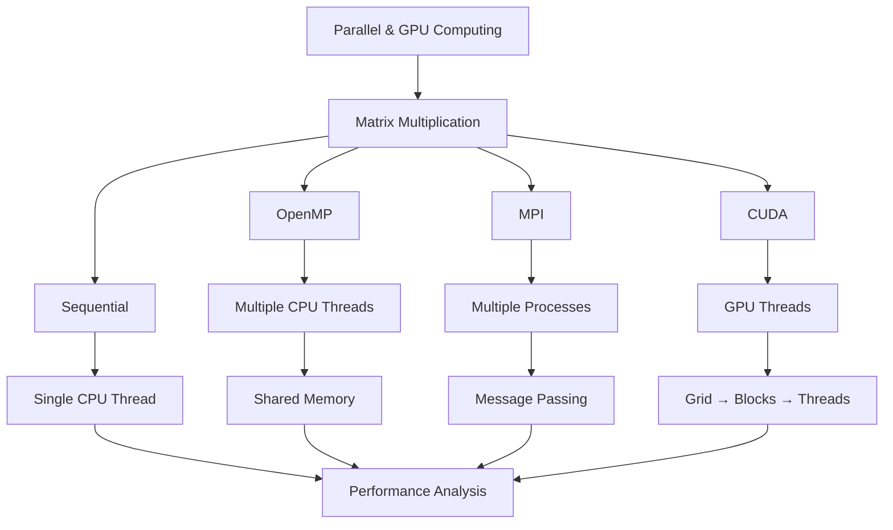
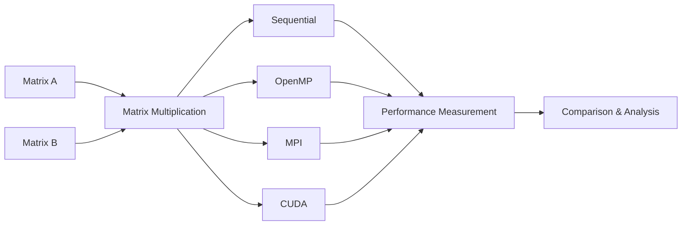

# Parallel and GPU Computing

> **Implementation and Analysis of Matrix Multiplication using Sequential, OpenMP, MPI, and CUDA**

---

## 📌 Overview

This repository contains implementations and experiments for **Parallel and GPU Computing**.

The primary experiment focuses on **Matrix Multiplication** and demonstrates how the same computational problem can be executed using different computing models:

* 🖥️ **Sequential Computing**
* 🧵 **OpenMP Thread Parallelism**
* 🔄 **MPI Process Parallelism**
* ⚡ **CUDA GPU Parallelism**

The experiment progresses from a single CPU execution flow to highly parallel GPU execution.

---

## 🧭 Computing Model Overview



---

## 🎯 Objectives

The main objectives of this experiment are:

* To implement matrix multiplication using different computing models.
* To understand sequential execution and establish a baseline.
* To implement CPU thread-level parallelism using OpenMP.
* To implement process-level parallelism and message passing using MPI.
* To implement GPU-based parallelism using CUDA.
* To compare the execution models using performance measurements.

---

## 🧮 Problem Statement

Matrix multiplication is selected as the common computational problem for all four implementations.

Given two matrices **A** and **B**, the objective is to compute the resulting matrix **C**:

```text
A × B = C
```

Let:

* Matrix **A** have dimensions `M × K`
* Matrix **B** have dimensions `K × N`
* Matrix **C** have dimensions `M × N`

Each element of the result matrix **C** is calculated as:

```text
C[i][j] = Σ A[i][k] × B[k][j]
          k=0 to K-1
```

or mathematically:

**Cᵢⱼ = Σₖ Aᵢₖ Bₖⱼ**

The same matrix multiplication problem is implemented using:

1. **Sequential CPU execution**
2. **OpenMP shared-memory parallelism**
3. **MPI distributed process parallelism**
4. **CUDA GPU parallelism**

The execution time and other performance metrics are measured and compared to understand the advantages and characteristics of each computing model.

---

## 🧠 Matrix Multiplication Concept

For example:

```text
A =              B =              C = A × B

[a  b]           [e  f]           [ae + bg   af + bh]
[c  d]     ×     [g  h]     =     [ce + dg   cf + dh]
```

Each element of matrix **C** is obtained by multiplying a row of **A** with a column of **B**.

---

## ⚙️ Computing Models

### 1. 🖥️ Sequential Computing

The sequential implementation performs matrix multiplication using a **single CPU thread**.

```text
CPU
 │
 └── Single Thread
       │
       ├── Compute C[0][0]
       ├── Compute C[0][1]
       ├── Compute C[1][0]
       └── ...
```

This implementation serves as the **baseline** for performance comparison.

---

### 2. 🧵 OpenMP

OpenMP is used to parallelize matrix multiplication using **multiple CPU threads**.

```text
              CPU
               │
      ┌────────┼────────┐
      │        │        │
   Thread 0 Thread 1 Thread 2 ...
      │        │        │
      └────────┼────────┘
               │
        Shared Memory
```

Multiple threads work on different portions of the matrix simultaneously.

OpenMP uses **shared memory**, meaning all threads can access the same matrices.

---

### 3. 🔄 MPI

MPI (Message Passing Interface) uses multiple **processes** to perform matrix multiplication.

```text
                 MPI
                  │
        ┌─────────┼─────────┐
        │         │         │
    Process 0  Process 1  Process 2
        │         │         │
        └─────────┼─────────┘
                  │
           Message Passing
```

Each process performs computation on a portion of the matrix and communicates with other processes when required.

Unlike OpenMP, MPI processes have **separate memory spaces**.

---

### 4. ⚡ CUDA

CUDA executes matrix multiplication on the **GPU** using thousands of GPU threads.

```text
                 CPU / Host
                     │
             CUDA Kernel Launch
                     │
                     ▼
                 GPU / Device
                     │
              ┌──────┴──────┐
              │     Grid    │
              │             │
              │ ┌───┐ ┌───┐ │
              │ │ B0│ │ B1│ │
              │ └───┘ └───┘ │
              │   Blocks     │
              │      │       │
              │    Threads   │
              └──────────────┘
```

Each GPU thread can be responsible for calculating one or more elements of the result matrix.

---

## 📊 Performance Metrics

The four implementations are compared using the following performance metrics:

| Metric             | Description                                                |
| ------------------ | ---------------------------------------------------------- |
| **Execution Time** | Time required to complete matrix multiplication            |
| **Speedup**        | Performance improvement compared with sequential execution |
| **Throughput**     | Amount of computation completed per unit time              |
| **CPU Usage**      | CPU resource utilization                                   |
| **GPU Usage**      | GPU resource utilization for CUDA                          |
| **Latency**        | Time taken to begin/complete the computation               |
| **Efficiency**     | Effective utilization of available processing resources    |

### Speedup

The speedup of a parallel implementation is calculated as:

```text
Speedup = Sequential Execution Time
          --------------------------
          Parallel Execution Time
```

---

## 📁 Project Structure

```text
Parallel-GPU-Computing/
│
├── Exp1/
│   │
│   ├── Sequential/
│   │   ├── matrix_multiplication.c
│   │   └── README.md
│   │
│   ├── OpenMP/
│   │   ├── matrix_multiplication.c
│   │   └── README.md
│   │
│   ├── MPI/
│   │   ├── matrix_multiplication.c
│   │   └── README.md
│   │
│   └── CUDA/
│       ├── matrix_multiplication.cu
│       └── README.md
│
├── Results/
│   ├── execution_time.png
│   ├── speedup.png
│   ├── throughput.png
│   └── performance_comparison.png
│
└── README.md
```

---

## 🧪 Experiment Workflow



---

# 📈 Performance Analysis

The performance of **Sequential, OpenMP, MPI, and CUDA** implementations is analyzed using the same matrix multiplication workload.

To ensure a fair comparison, the following experimental conditions should be kept consistent:

* Same matrix dimensions
* Same input data
* Same data type
* Same number of matrix multiplication operations
* Same number of experimental runs where applicable
* Appropriate hardware and software configurations recorded

The measured results are used to generate comparison graphs.

---

## ⏱️ 1. Execution Time Comparison

Execution time represents the time required to complete the matrix multiplication.


### Analysis

The execution-time graph compares the time taken by each computing model.

* **Sequential** execution provides the baseline.
* **OpenMP** divides the computation among multiple CPU threads.
* **MPI** distributes the computation among multiple processes.
* **CUDA** distributes matrix operations across GPU threads.

A lower execution time indicates that the computation was completed in less time under the tested conditions.

---

## 🚀 2. Speedup Comparison

Speedup measures the performance improvement of each parallel implementation relative to the sequential implementation.

The speedup is calculated as:

```text
                    Sequential Execution Time
Speedup = ----------------------------------------------
                    Parallel Execution Time
```

The sequential implementation has a speedup of:

```text
1.00×
```

because it is the baseline.


### Analysis

The speedup graph shows how much faster each parallel implementation performs relative to the sequential version.

For example, if:

```text
Sequential = 10 seconds
OpenMP     = 5 seconds
```

then:

```text
Speedup = 10 / 5
        = 2×
```

Therefore, the OpenMP implementation achieves a **2× speedup** for that particular measurement.

> The actual values in the graph must be obtained from the experimental results.

---

## 📊 3. Throughput Comparison

Throughput represents the amount of computation completed per unit of time.

For matrix multiplication, throughput can be represented using the number of floating-point operations completed per second.

For an `M × K` matrix multiplied by a `K × N` matrix, the approximate number of floating-point operations is:

```text
FLOPs ≈ 2 × M × K × N
```

Therefore:

```text
Throughput = Total Floating-Point Operations
             --------------------------------
                  Execution Time
```


### Analysis

The throughput graph provides another way to compare the four computing models.

A higher throughput means that the implementation completes more computational work per unit of time.

---

## 💻 4. Resource Utilization Analysis

Resource utilization helps determine how the available hardware resources are being used.

The experiment can record:

* CPU utilization
* Number of CPU threads
* Number of MPI processes
* GPU utilization
* GPU memory usage
* GPU execution configuration


### Analysis

#### Sequential

The sequential implementation primarily uses a single CPU execution flow.

#### OpenMP

OpenMP can utilize multiple CPU cores through multiple threads. The amount of parallelism depends on the number of threads and the available CPU resources.

#### MPI

MPI uses multiple processes. Each process has its own memory space and performs its assigned portion of the computation.

#### CUDA

CUDA uses GPU threads organized into **blocks** and **grids**. This allows a large number of matrix elements to be processed concurrently.

---

## 📋 5. Performance Results Table

The measured results can be summarized using the following table:

| Computing Model | Execution Time | Speedup | Throughput | CPU Usage | GPU Usage |
| --------------- | -------------: | ------: | ---------: | --------: | --------: |
| Sequential      |              — |   1.00× |          — |         — |       N/A |
| OpenMP          |              — |       — |          — |         — |       N/A |
| MPI             |              — |       — |          — |         — |       N/A |
| CUDA            |              — |       — |          — |         — |         — |

> **Note:** Replace the `—` values with the actual measurements obtained during the experiment.

---

## 📐 6. Performance Calculation

### Speedup

```text
Speedup = T_sequential / T_parallel
```

where:

* `T_sequential` = execution time of the sequential implementation
* `T_parallel` = execution time of the corresponding parallel implementation

---

### Throughput

For matrix multiplication:

```text
Operations ≈ 2 × M × K × N
```

Therefore:

```text
Throughput = Operations / Execution Time
```

---

### Parallel Efficiency

For CPU parallel implementations, efficiency can be calculated as:

```text
Efficiency = Speedup / Number of Processing Units
```

For OpenMP:

```text
Efficiency = Speedup / Number of Threads
```

For MPI:

```text
Efficiency = Speedup / Number of Processes
```

---

# 📊 7. Overall Comparison

The four implementations use different forms of parallelism:

| Feature         | Sequential        | OpenMP           | MPI                             | CUDA                      |
| --------------- | ----------------- | ---------------- | ------------------------------- | ------------------------- |
| Execution Model | Single thread     | Multiple threads | Multiple processes              | GPU threads               |
| Parallelism     | None              | Thread-level     | Process-level                   | Massive thread-level      |
| Memory Model    | Shared CPU memory | Shared memory    | Separate process memory         | GPU device memory         |
| Communication   | Not required      | Shared memory    | Message passing                 | Host-device communication |
| Hardware        | CPU               | CPU              | CPU / multiple processes        | GPU                       |
| Main Purpose    | Baseline          | CPU parallelism  | Distributed/process parallelism | GPU parallelism           |

---

## 🔬 8. Observations

The experimental observations are recorded based on the measured results.

### Sequential

* Provides the baseline for comparison.
* Uses a single CPU execution flow.
* Simple implementation with no parallelization overhead.

### OpenMP

* Uses multiple CPU threads.
* Can reduce execution time through shared-memory parallelism.
* Performance depends on the number of threads and CPU architecture.
* Thread creation and synchronization introduce some overhead.

### MPI

* Uses multiple processes.
* Supports message passing between processes.
* Can distribute computation across multiple processing units.
* Communication and synchronization can introduce overhead.

### CUDA

* Uses GPU-based parallel execution.
* Provides a large number of concurrent threads.
* Suitable for highly parallel matrix operations.
* Data transfer between CPU and GPU can contribute to total execution time.

---

## ⚠️ 9. Factors Affecting Performance

The measured performance can be affected by several factors:

1. **Matrix Size**
   Larger matrices generally provide more computational work and can better expose parallelism.

2. **Number of OpenMP Threads**
   Increasing the number of threads does not always produce proportional speedup.

3. **Number of MPI Processes**
   Performance depends on process count and communication overhead.

4. **GPU Configuration**
   CUDA performance depends on the GPU architecture, block size, grid size, and memory access pattern.

5. **Memory Access**
   Efficient memory access can significantly affect matrix multiplication performance.

6. **Communication Overhead**
   MPI communication and CPU-GPU data transfers can affect the total execution time.

7. **System Load**
   Background processes can affect CPU and GPU measurements.

---

## 📈 10. Graphs and Results

The following graphs are generated from the experimental measurements:

### Execution Time

```text
Results/execution_time.png
```


### Speedup

```text
Results/speedup.png
```


### Throughput

```text
Results/throughput.png
```


### Overall Performance

```text
Results/performance_comparison.png
```


> **Important:** The graphs should contain only the actual values obtained from the experiment. Do not use illustrative values as experimental results.

---

# 📝 Conclusion

This experiment demonstrates how the same matrix multiplication problem can be implemented using different computing models.

Starting from **sequential execution**, the experiment progresses to **CPU thread-level parallelism using OpenMP**, **process-level parallelism using MPI**, and **GPU-based parallelism using CUDA**.

The performance analysis compares these implementations using:

* Execution time
* Speedup
* Throughput
* CPU utilization
* GPU utilization
* Parallel efficiency

The comparison graphs provide a visual representation of the performance differences between the four computing models and help demonstrate the effects of different parallel execution strategies.

---

## 👨‍💻 Experiment Summary

```text
                    Matrix Multiplication
                            │
          ┌─────────────────┼─────────────────┐
          │                 │                 │
      Sequential          OpenMP             MPI
          │                 │                 │
     Single Thread     CPU Threads       CPU Processes
          │                 │                 │
          └─────────────────┼─────────────────┘
                            │
                          CUDA
                            │
                       GPU Threads
                            │
                            ▼
                 Performance Analysis
                            │
            ┌───────────────┼───────────────┐
            │               │               │
       Execution Time    Speedup       Throughput
            │               │               │
            └───────────────┼───────────────┘
                            │
                            ▼
                    Final Comparison
```
