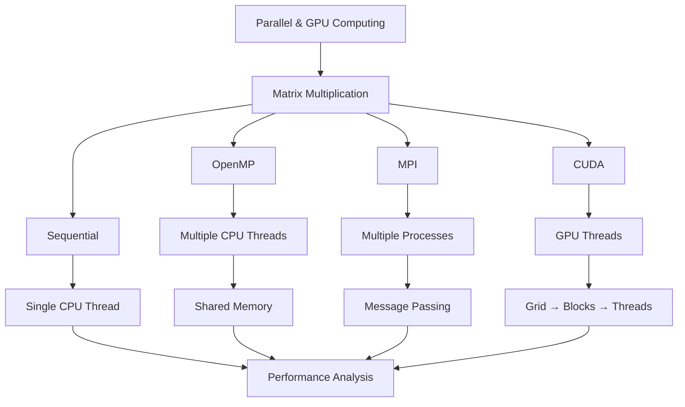
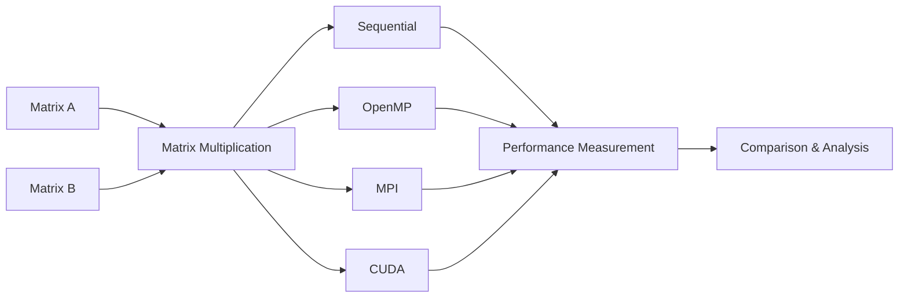

# Parallel and GPU Computing

> **Implementation and Analysis of Matrix Multiplication using Sequential, OpenMP, MPI, and CUDA**

---

## 📌 Overview

This repository contains implementations and experiments for **Parallel and GPU Computing**.

The primary experiment focuses on **Matrix Multiplication** and demonstrates how the same computational problem can be executed using different computing models:

* 🖥️ **Sequential Computing**
* 🧵 **OpenMP Thread Parallelism**
* 🔄 **MPI Process Parallelism**
* ⚡ **CUDA GPU Parallelism**

The experiment progresses from a single CPU execution flow to highly parallel GPU execution.

---

## 🧭 Computing Model Overview



---

## 🎯 Objectives

The main objectives of this experiment are:

* To implement matrix multiplication using different computing models.
* To understand sequential execution and establish a baseline.
* To implement CPU thread-level parallelism using OpenMP.
* To implement process-level parallelism and message passing using MPI.
* To implement GPU-based parallelism using CUDA.
* To compare the execution models using performance measurements.

---

## 🧮 Problem Statement

Matrix multiplication is selected as the common computational problem for all four implementations.

Given two matrices **A** and **B**, the objective is to compute the resulting matrix **C**:

```text
A × B = C
```

Let:

* Matrix **A** have dimensions `M × K`
* Matrix **B** have dimensions `K × N`
* Matrix **C** have dimensions `M × N`

Each element of the result matrix **C** is calculated as:

```text
C[i][j] = Σ A[i][k] × B[k][j]
          k=0 to K-1
```

or mathematically:

**Cᵢⱼ = Σₖ Aᵢₖ Bₖⱼ**

The same matrix multiplication problem is implemented using:

1. **Sequential CPU execution**
2. **OpenMP shared-memory parallelism**
3. **MPI distributed process parallelism**
4. **CUDA GPU parallelism**

The execution time and other performance metrics are measured and compared to understand the advantages and characteristics of each computing model.

---

## 🧠 Matrix Multiplication Concept

For example:

```text
A =              B =              C = A × B

[a  b]           [e  f]           [ae + bg   af + bh]
[c  d]     ×     [g  h]     =     [ce + dg   cf + dh]
```

Each element of matrix **C** is obtained by multiplying a row of **A** with a column of **B**.

---

## ⚙️ Computing Models

### 1. 🖥️ Sequential Computing

The sequential implementation performs matrix multiplication using a **single CPU thread**.

```text
CPU
 │
 └── Single Thread
       │
       ├── Compute C[0][0]
       ├── Compute C[0][1]
       ├── Compute C[1][0]
       └── ...
```

This implementation serves as the **baseline** for performance comparison.

---

### 2. 🧵 OpenMP

OpenMP is used to parallelize matrix multiplication using **multiple CPU threads**.

```text
              CPU
               │
      ┌────────┼────────┐
      │        │        │
   Thread 0 Thread 1 Thread 2 ...
      │        │        │
      └────────┼────────┘
               │
        Shared Memory
```

Multiple threads work on different portions of the matrix simultaneously.

OpenMP uses **shared memory**, meaning all threads can access the same matrices.

---

### 3. 🔄 MPI

MPI (Message Passing Interface) uses multiple **processes** to perform matrix multiplication.

```text
                 MPI
                  │
        ┌─────────┼─────────┐
        │         │         │
    Process 0  Process 1  Process 2
        │         │         │
        └─────────┼─────────┘
                  │
           Message Passing
```

Each process performs computation on a portion of the matrix and communicates with other processes when required.

Unlike OpenMP, MPI processes have **separate memory spaces**.

---

### 4. ⚡ CUDA

CUDA executes matrix multiplication on the **GPU** using thousands of GPU threads.

```text
                 CPU / Host
                     │
             CUDA Kernel Launch
                     │
                     ▼
                 GPU / Device
                     │
              ┌──────┴──────┐
              │     Grid    │
              │             │
              │ ┌───┐ ┌───┐ │
              │ │ B0│ │ B1│ │
              │ └───┘ └───┘ │
              │   Blocks     │
              │      │       │
              │    Threads   │
              └──────────────┘
```

Each GPU thread can be responsible for calculating one or more elements of the result matrix.

---

## 📊 Performance Metrics

The four implementations are compared using the following performance metrics:

| Metric             | Description                                                |
| ------------------ | ---------------------------------------------------------- |
| **Execution Time** | Time required to complete matrix multiplication            |
| **Speedup**        | Performance improvement compared with sequential execution |
| **Throughput**     | Amount of computation completed per unit time              |
| **CPU Usage**      | CPU resource utilization                                   |
| **GPU Usage**      | GPU resource utilization for CUDA                          |
| **Latency**        | Time taken to begin/complete the computation               |
| **Efficiency**     | Effective utilization of available processing resources    |

### Speedup

The speedup of a parallel implementation is calculated as:

```text
Speedup = Sequential Execution Time
          --------------------------
          Parallel Execution Time
```

---

## 📁 Project Structure

```text
Parallel-GPU-Computing/
│
├── Exp1/
│   │
│   ├── Sequential/
│   │   ├── matrix_multiplication.c
│   │   └── README.md
│   │
│   ├── OpenMP/
│   │   ├── matrix_multiplication.c
│   │   └── README.md
│   │
│   ├── MPI/
│   │   ├── matrix_multiplication.c
│   │   └── README.md
│   │
│   └── CUDA/
│       ├── matrix_multiplication.cu
│       └── README.md
│
├── Results/
│   ├── execution_time.png
│   ├── speedup.png
│   └── performance_comparison.png
│
└── README.md
```

---

## 🧪 Experiment Workflow



---

## 📈 Performance Comparison

The performance results obtained from the four implementations are recorded and compared.

| Computing Model | Execution Time | Speedup | Throughput | CPU Usage | GPU Usage |
| --------------- | -------------: | ------: | ---------: | --------: | --------: |
| Sequential      |              — |   1.00× |          — |         — |       N/A |
| OpenMP          |              — |       — |          — |         — |       N/A |
| MPI             |              — |       — |          — |         — |       N/A |
| CUDA            |              — |       — |          — |         — |         — |

> **Note:** The values in the table should be replaced with the actual experimental measurements.

---

## 🔍 Analysis

The experiment analyzes how matrix multiplication behaves under different computing models.

### Sequential

* Uses a single CPU execution flow.
* Provides the baseline execution time.
* No parallel execution is involved.

### OpenMP

* Uses multiple CPU threads.
* Threads share the same memory.
* Performance depends on the number of threads and CPU resources.

### MPI

* Uses multiple independent processes.
* Processes communicate through message passing.
* Suitable for distributed-memory environments.

### CUDA

* Uses GPU parallelism.
* Thousands of GPU threads can execute concurrently.
* Particularly useful for highly parallel numerical computations.

---

## 📝 Conclusion

This experiment demonstrates how the same matrix multiplication problem can be implemented using different computing models.

Starting from **sequential execution**, the experiment progresses to **CPU thread-level parallelism using OpenMP**, **process-level parallelism using MPI**, and **GPU-based parallelism using CUDA**.

By measuring execution time, speedup, throughput, resource utilization, and other performance metrics, the experiment provides a practical understanding of the differences between sequential, shared-memory, distributed-memory, and GPU computing models.
